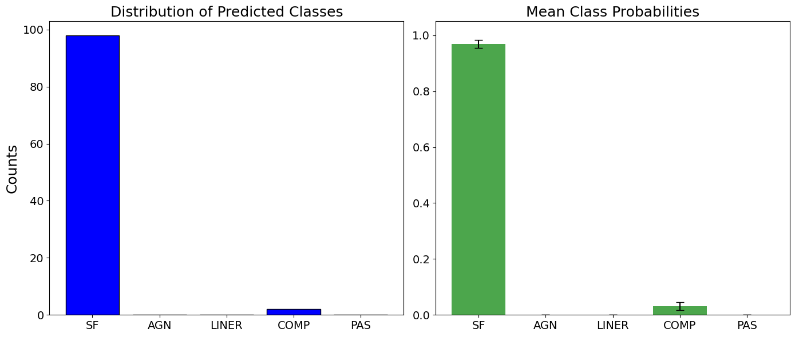

# OptSpecClassifier

An automated activity classification tool for optical galaxy spectra - decomposing galaxy activity

A SVM-based, 3-dimensional galaxy activity classifier for optical spectra

Repository for galaxy activity classifier presented in the paper: "An automated activity classification tool for optical galaxy spectra"\
Astronomy & Astrophysics\
ArXiv: TBD \
ADS: TBD \
Publisher (A&A): TBD

**Authors:**\
C. Daoutis, A. Zezas, E. Kyritsis, K. Kouroumpatzakis, and P. Bonfini

### Abstract 
**Context.** Reliable and versatile galaxy activity diagnostic tools are indispensable for comprehending the physical processes that drive galaxy evolution. Traditional methodologies frequently necessitate extensive preprocessing, such as starlight subtraction and emission line deblending (e.g., Hα and [N II]), which can introduce substantial biases and uncertainties due to their model-dependent nature. Additionally, numerous diagnostics omit the inclusion of dormant (passive) galaxies. \
**Aims.** This work aims to develop a reliable, automated, and efficient diagnostic tool capable of distinguishing between star-forming, active galactic nuclei (AGN), low-ionization nuclear emission-line regions (LINERs), composite, and passive galaxies under one unified scheme. \
**Methods.** We developed a diagnostic tool based on a support vector machine trained on ground truth data originating from optical emission-line ratios and color selection criteria. Building upon previous literature findings and exploring various combinations of discriminatory feature schemes, we identified the equivalent widths (EWs) of Hβ, [O III]λ5007, and Hα+[N II]λλ6548,84 as key discriminatory features. Additionally, galaxies classified as AGN can be distinguished into broad and narrow line AGN by measuring the full quarter at the half-maximum of Hα and [N II] complex. \
**Results.**  Employing machine learning algorithms and three EWs directly measured from the galaxy’s optical spectrum, we have developed a diagnostic tool that encompasses all potential activities of galaxies while simultaneously achieving high performance scores across all of them. Our diagnostic achieves overall accuracy of ~83% and recall of ~79% for star forming, ~94% for AGN, ~85% for LINER, ~77% for composite, and ~96% for passive galaxies.\
**Conclusions.** Our diagnostic tool offers a substantial enhancement over the existing galaxy activity diagnostics as it can be applied to a broad number of spectra, eliminates the requirement for preprocessing (i.e., starlight subtraction or flux calibration) of the spectra and spectral line deblending, encompasses all activity classes under one unified scheme, and offers the ability to distinguish between the two main types of AGN. In addition, the omission of starlight subtraction was not found to be a significant detriment to diagnostic's performance. Furthermore, its narrow wavelength requirement for its application enables its use to a large number of galaxy samples, making it highly relevant to the activity studies of galaxies observed at high redshifts such as the James Webb Space Telescope (JWST).

### Application of the model

This repository contains all essential files, including a Jupyter notebook demonstration. The pre-trained SVM model, '.sav', implements the algorithm detailed in the referenced paper. We have included 'test_sample_galaxies.csv' for verification purposes.
Output of classifier
Once the model has been applied to a galaxy spectrum, the output is probabilistic. Instead of a single label, the classifier provides a full probability distribution across all classes based on Monte Carlo simulations. This includes:
Mean Probability: The average likelihood that the spectrum belongs to a specific class.
Standard Deviation: The uncertainty associated with that prediction, reflecting the noise in the spectral measurements.
For objects classified as AGN, the pipeline performs an additional kinematic check (measuring FWQM of Hα) to distinguish between Broad Line and Narrow Line AGN.\
\
Classification legend:\
The model distinguishes between the following spectral classes:\
SF: Star-Forming Galaxies\
AGN: Active Galactic Nuclei (Seyfert)\
LINER: Low-Ionization Nuclear Emission-line Region\
COMP: Composite\
PAS: Passive Galaxies (Quiescent)

## Implementation & Usage

The `notebooks/` directory contains a comprehensive walkthrough demonstrating how to apply this diagnostic tool to your spectral data. The notebook provides step-by-step instructions for data ingestion, preprocessing, and model execution.

#### Diagnostic Output
The pipeline generates a dual-layer classification result:
* **Majority Vote:** The final predicted class based on model consensus.
* **Class Probabilities:** A detailed breakdown of the predicted probability for each available class, indicating the model's confidence level.

**Output Example:**




## Installation & Setup

   **Option 1:**
Run the *environment.yml* file:

This project requires a specific Python environment to run correctly. We use **Conda** to manage dependencies.

### Prerequisites
Ensure you have **Anaconda** or **Miniconda** installed on your system. If not, you can download [Miniconda here](https://docs.conda.io/en/latest/miniconda.html).

### Setting up the Environment

1.  **Clone the repository**:
    ```bash
    cd <your-install-dir>
    ```
    ```
    git clone https://github.com/BabisDaoutis/OptSpecClassifier.git
    ```
    ```
    cd OptSpecClassifier
    ```

3.  **Create the Conda environment:**
    Run the following command to install Python 3.13.2 and all required libraries (Astropy, Matplotlib, Pandas, etc.) as defined in `environment.yml`:
    ```bash
    conda env create -f environment.yml
    ```

4.  **Activate the environment:**
    ```bash
    conda activate OptSpecClassifier
    ```

5.  **Verify installation (Optional):**
    You can ensure all packages are installed correctly by running:
    ```bash
    conda list
    ```
6. Install in the environment (Optional):
   ```bash
   pip install -e .
   ```
    We recommend installing the package in editable mode via ```pip install -e .```. This registers the project within your Python environment, enabling you to import it
   globally from any directory without the need to manually copy or duplicate source files.

**Option 2:**
In case there are issues running the *environment.yml*, you can run the following commands in a terminal one by one:

```
conda create --name OptSpecClassifier python=3.13.2
conda activate OptSpecClassifier
conda install scikit-learn=1.6.1
conda install numpy=2.2.4
conda install astropy=7.0.1
conda install matplotlib=3.10.1
conda install pandas=2.2.3
conda install scipy=1.15.2
conda install joblib=1.4.2
conda install jupyter notebook
```
